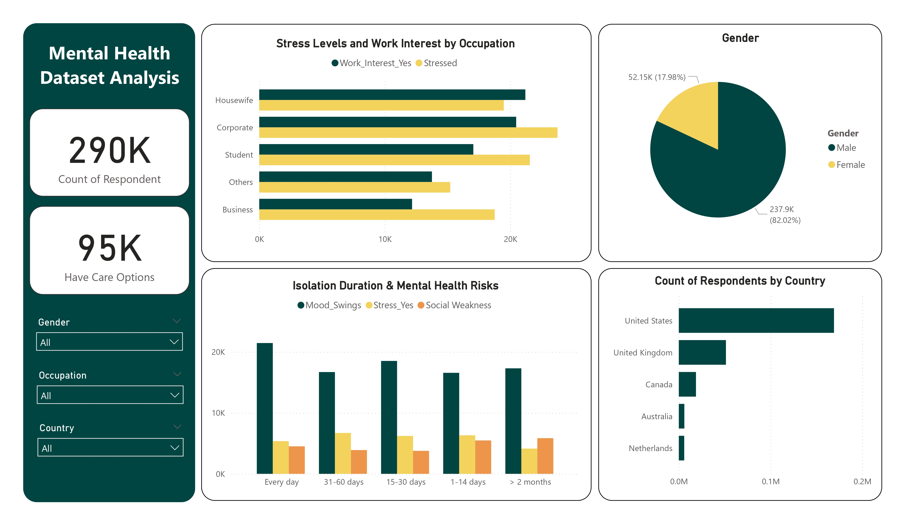

# 🧠 Mental Health Dataset Analysis 📊

This project is an end-to-end **Exploratory Data Analysis (EDA)** and **Interactive Dashboard** built on Kaggle’s [Mental Health Dataset](https://www.kaggle.com/datasets/bhavikjikadara/mental-health-dataset).

The goal is to uncover patterns in stress, mood, isolation, occupation, and treatment to support mental health awareness and targeted interventions.

---

## 📂 Dataset Overview

- **Source:** Kaggle Mental Health Dataset  
- **Records:** ~290,000 rows  
- **Features:** 17 columns — Demographics, Occupation, Stress, Mood Swings, Coping Struggles, Isolation Days, Treatment, Care Options, and more.

---

## 🛠️ Tools & Technologies

- **Python:** Pandas, Seaborn, Matplotlib for data cleaning, transformation & EDA.
- **Power BI:** For building an interactive, insight-driven dashboard.
- **Jupyter Notebook:** For clear, step-by-step code and visualizations.

---

## 📊 Key Insights

- 🏠 **Isolation Impact:** Longer indoor isolation is linked with higher stress, mood swings, and social weakness.
- 💼 **Occupation:** Some roles show higher stress and lower work interest — burnout risk.
- ⚧️ **Gender & Treatment:** Gender breakdown highlights differences in treatment seeking.
- 👨‍👩‍👧 **Family History:** Strong link between family history and likelihood of seeking help.
- 🌍 **Top Countries:** Most responses come from key regions, useful for targeted outreach.

---

## ⭐ Recommendations

- ✅ Support employees in high-stress jobs with burnout prevention measures.
- ✅ Encourage community engagement for isolated individuals.
- ✅ Use gender & region breakdowns for targeted mental health programs.
- ✅ Promote accessible care options for families with mental illness history.

---

## 📸 Dashboard Preview



---

## 📎 Project Structure

```plaintext
├── notebooks/
│   ├── mental_health_analysis.ipynb  # Python EDA notebook
├── dashboard/
│   ├── mental_health_dashboard.pbix  # Power BI dashboard file
├── data/
│   ├── Mental Health Dataset.csv     # Raw dataset
├── requirements.txt                  # Python dependencies
├── README.md                         # Project overview & instructions
```
---

## 🚀 How to Run

1. **Clone** this repository  
2. Open the **Jupyter Notebook** for Python EDA  
3. Open the `.pbix` file in Power BI Desktop for the dashboard

---

## 📌 Credits

- **Dataset:** [Mental Health Dataset on Kaggle](https://www.kaggle.com/datasets/bhavikjikadara/mental-health-dataset)

---

## 🤝 Let’s Connect

Open to feedback, suggestions, or collaboration!  
Feel free to **fork** this repo or connect with me on [LinkedIn](https://www.linkedin.com/in/reham-mahmoud-rushdi/).

---
